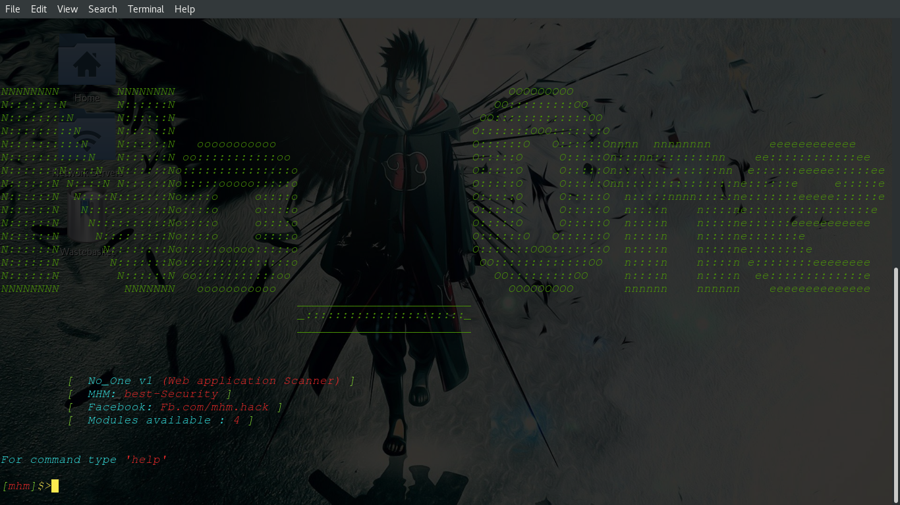
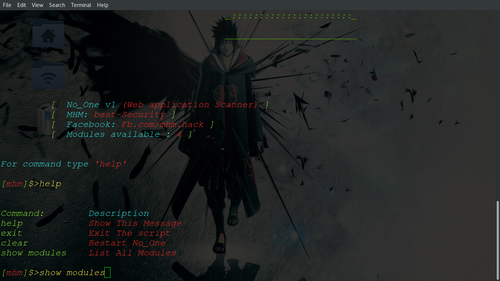
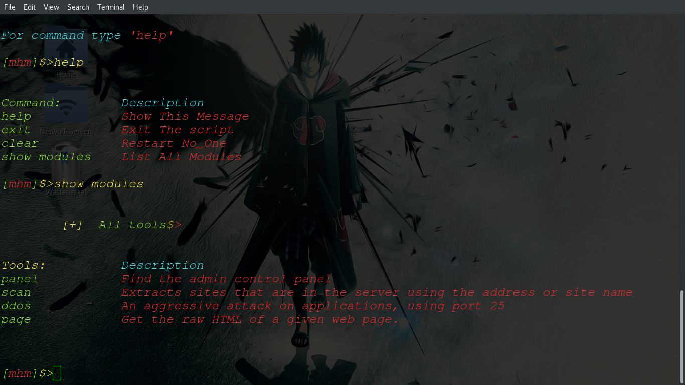

<pre style="color:#03F200; background:#000;">

888b    888                .d88888b.                  
8888b   888               d88P" "Y88b                 
88888b  888               888     888                 
888Y88b 888 .d88b.        888     88888888b.  .d88b.  
888 Y88b888d88""88b       888     888888 "88bd8P  Y8b 
888  Y88888888  888       888     888888  88888888888 
888   Y8888Y88..88P       Y88b. .d88P888  888Y8b.     
888    Y888 "Y88P"88888888 "Y88888P" 888  888 "Y8888  
</pre>                                                      
                                                      

###################################

 

 

root@root:~# python -m pip install requirements.txt

cmd to run :
cd to your folder and put in cmd these commands :

root@root:~# python NoOne.py

* Use "help" to recognize commands and tools...

1-Use "panel"to find a panel...

2-Use "ddos" to attack applications...

3-Use "page" Get the raw HTML of a given web page...

4-Use "scan" to pull server locations:

	     ///if your list sites :
	     ///Do not put a set of "http or https" sites in the list///
	     ///if your list ips there are no problems 😊 ///
	    
example:
   Enter Your List IPS or List Site: ip.txt

######################################

I hope the script is easy to use 😉 
 
